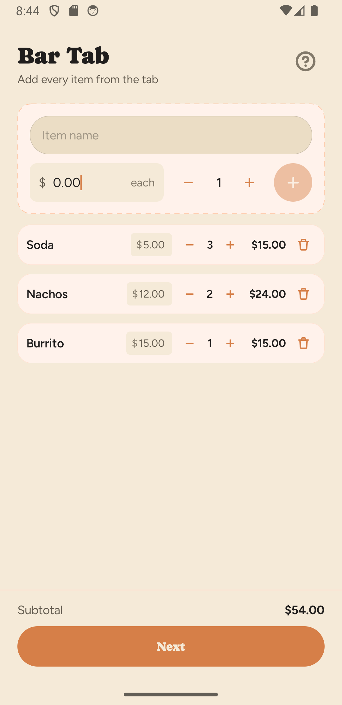
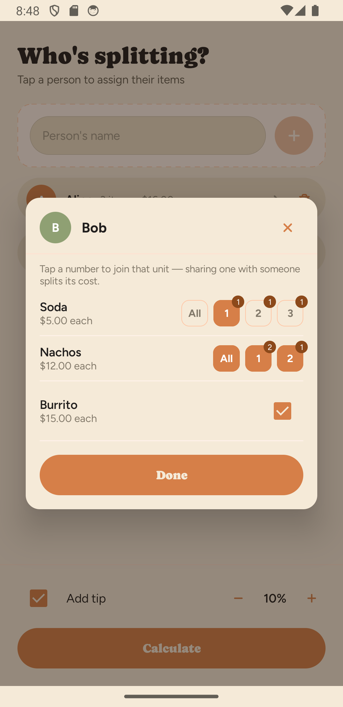
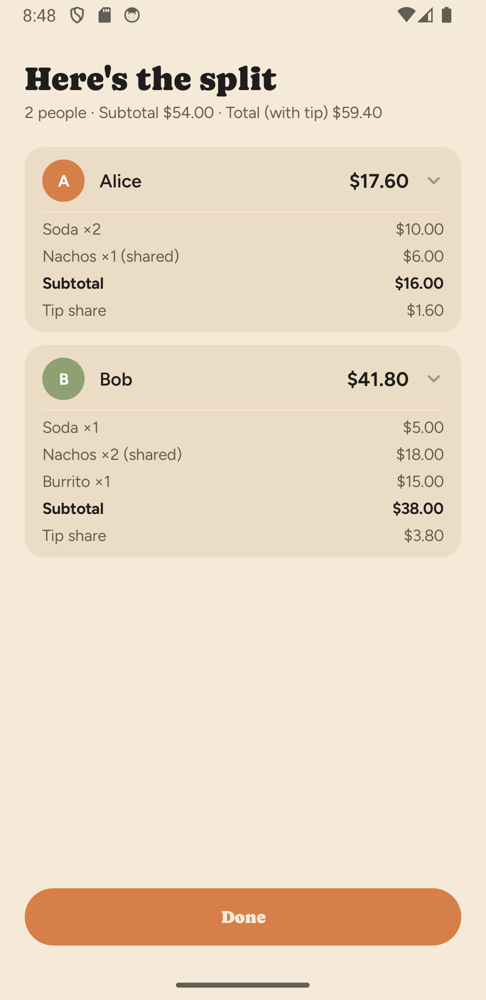

# BarCalc

A small, native Android app for splitting a bar tab **item by item** — including
individual units of a shared round — down to the exact cent. Built with Jetpack
Compose.

<p align="center">
  
  
  
</p>

## What it does

A three-step wizard:

1. **Items** — add each item on the tab (name, price, quantity), editable inline.
2. **People** — add who's splitting, then tap a person to open their **claim
   sheet**. Each item has one slot per unit; tapping a unit claims it. When two
   people claim the same unit, its price splits between them. Add an optional
   tip.
3. **Results** — a per-person total, expandable into a breakdown of each item,
   their subtotal, and their share of the tip.

Highlights:

- **Exact-cent math.** All money is integer cents; uneven splits hand out the
  leftover pennies by largest remainder, so the shares always sum *exactly* to
  the total (no $9.99-from-$10.00 drift).
- **Per-unit claiming.** Share one beer out of a round of three without splitting
  the whole line — or claim the entire round in a single tap.
- **Proportional tip.** Each person's tip is based on their own share of the tab,
  not an even split — someone who only had a $10 item tips on $10.
- **POS-style money entry.** Prices accumulate from the right as you type — key
  `1 0 5 0` and the field reads `10.50` — so amounts are always two decimals.
- **Persists across restarts.** An in-progress tab is saved and restored.
- **Localized** in English and Brazilian Portuguese (`pt-BR`), including the
  currency symbol.

## Tech stack

- **UI:** Jetpack Compose + Material 3, custom theme ported from a design system
  built in [Claude Design](https://claude.ai/design)
- **Architecture:** MVVM with unidirectional data flow — a single `TabViewModel`
  exposes immutable `TabUiState` via `StateFlow`; the UI sends `sealed TabAction`
  events through one `onAction` entry point, so screens are pure and previewable
- **Domain:** a dependency-free `SplitCalculator` (pure Kotlin, fully unit-tested)
- **Persistence:** Jetpack DataStore + `kotlinx.serialization` (JSON)
- **Build:** Android Gradle Plugin 9.1 (built-in Kotlin 2.2.10), Gradle version
  catalog

## Project structure

```
app/src/main/java/com/pedrotlf/barcalc/
├── MainActivity.kt
├── domain/                  # pure, Android-free
│   ├── TabItem.kt · Person.kt
│   └── SplitCalculator.kt    # the split engine (integer cents)
├── data/
│   └── SessionRepository.kt  # DataStore-backed session persistence
└── ui/
    ├── BarTabApp.kt          # root: screen switching + claim-sheet overlay
    ├── TabViewModel.kt · TabUiState.kt · TabAction.kt
    ├── theme/                # Color · Type · Dimens · Theme
    ├── components/           # reusable composables + Modifiers
    └── screens/              # Items · People · ClaimSheet · Results

app/src/test/…               # JUnit tests for the split engine + view model
```

## Building & running

Requirements: a recent Android Studio (AGP 9.1) and an Android 9+ device or
emulator (`minSdk 28`).

```bash
# Debug build
./gradlew :app:assembleDebug

# Install on a connected device/emulator
./gradlew :app:installDebug

# Unit tests (the split engine + view model)
./gradlew :app:testDebugUnitTest
```

Or just open the project in Android Studio and hit **Run**.

### Trying the Portuguese translation

Without changing your whole device, set a per-app locale (Android 13+):

```bash
adb shell cmd locale set-app-locales com.pedrotlf.barcalc --user 0 --locales pt-BR
# reset with: --locales ""
```

## Credits & licenses

- **Fonts** (bundled in `app/src/main/res/font/`) are used under the
  [SIL Open Font License 1.1](https://scripts.sil.org/OFL); full texts in
  [`licenses/`](licenses/):
  - **Caprasimo** — © 2023 The Caprasimo Project Authors
  - **Figtree** — © 2022 The Figtree Project Authors
- **Design & build.** BarCalc's visual design — layouts, the "Organic"
  design-system tokens (colors, spacing, radii, type scale), and the launcher
  icon — was elaborated in [Claude Design](https://claude.ai/design), and the app
  was built with [Claude Code](https://claude.com/claude-code), Anthropic's AI
  coding agent. The design tokens are ported into
  [`ui/theme/`](app/src/main/java/com/pedrotlf/barcalc/ui/theme).

The application code is **all rights reserved**. It's published here to read and
learn from, not to reuse — no open-source license is granted for it (the bundled
fonts keep their own licenses, noted above).
